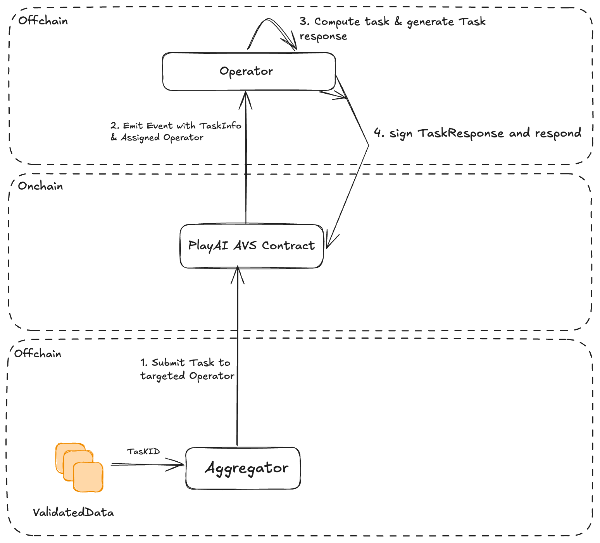

# PlayAI AVS Hello World

Welcome to the Hello World AVS.

This project shows you the simplest functionality you can expect from an AVS.

It will give you a concrete understanding of the basic components.



There are 5 steps to this AVS:
- Aggregator generates a task from Chunks of Video assigns a taskID
- Aggregator transacts taskID by emitting an event for operators to pick up the request targeting operator
- Assigned operator who is staked to serve this AVS takes this request using AVS client
- Compute the Task coordinating with Backend and optain taskResponseID 
- the operator submits this taskResponseID with their signature back to the AVS
- *if the operator is in fact registered to the AVS and has the minimum needed stake, the submission is accepted*


## Quick Start

### Dependencies

1. [npm](https://docs.npmjs.com/downloading-and-installing-node-js-and-npm)
2. [Foundry](https://getfoundry.sh/)
3. [Docker](https://www.docker.com/get-started/)
   * Make sure Docker is running for automated deployment

Following global NodeJS packages:
1. [Typescript](https://github.com/microsoft/TypeScript)

## Steps to run demo on playAI Service manager

This walks you through how to manually deploy using Foundry (Anvil, Forge, and Cast)
Clone it recusively using

```
git clone https://github.com/Layr-Labs/hello-world-avs.git --recurse-submodules
```

1. Run `npm install` to install the TypeScript dependencies
2. Run `cp .env.local .env`
3. Compile the contracts.

```sh
cd contracts && forge build
```

// If you face issue with failed to read artifact source just run
```
foundryup -v nightly-5b7e4cb3c882b28f3c32ba580de27ce7381f415a
```

4. Start Anvil by opening your terminal and running the following command:

```sh
anvil
```

5. In a separate terminal window, deploy the EigenLayer contracts.

To do so, change into `contracts/lib/eigenlayer-middleware/lib/eigenlayer-contracts` and run the following commands:

```sh
forge script script/deploy/devnet/M2_Deploy_From_Scratch.s.sol --rpc-url http://localhost:8545 \
--private-key 0xac0974bec39a17e36ba4a6b4d238ff944bacb478cbed5efcae784d7bf4f2ff80 --broadcast \
--sig "run(string memory configFile)" -- M2_deploy_from_scratch.anvil.config.json
```

6. In a separate terminal window, deploy the AVS contracts.

```sh
cd contracts

forge script script/PlayAIServiceManagerDeployer.s.sol --rpc-url http://localhost:8545 --private-key 0xac0974bec39a17e36ba4a6b4d238ff944bacb478cbed5efcae784d7bf4f2ff80 --broadcast -v
```

7. Start the operator

```sh
tsc && node dist/index.js
```

8. In a separate window, start creating tasks

```sh
tsc && node dist/createNewTasks.js
```

Note: Holesky deployment and testing is WIP
